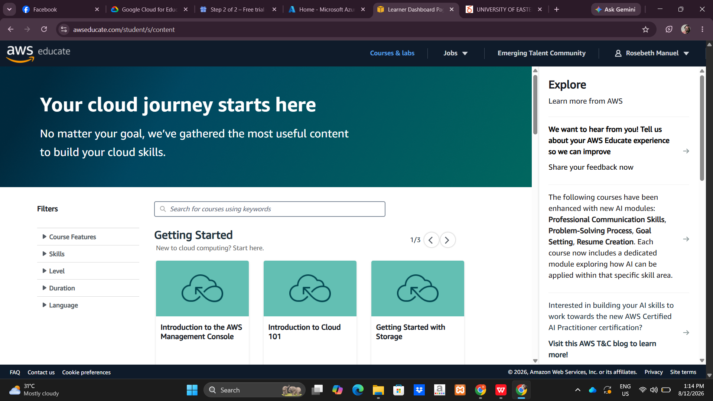

# AWS Research

## Brief Overview

Amazon Web Services (AWS) is a cloud computing platform that provides services for computing, storage, networking, databases, and security.

## Global Infrastructure

AWS has data centers organized into **Regions** and **Availability Zones** around the world. This allows applications to be deployed closer to users and designed for high availability.

## Cloud Management Console

The **AWS Management Console** is a web-based interface used to create, manage, and monitor AWS resources and services.

## Four Core Services

1. **Amazon EC2** – Provides virtual servers for running applications.
2. **Amazon S3** – Provides object storage for files and data.
3. **Amazon VPC** – Provides virtual networking for AWS resources.
4. **AWS IAM** – Manages users, permissions, and access to AWS resources.

## Three Advantages

* Wide range of cloud services
* Global infrastructure
* Scalable resources

## Typical Enterprise Use Cases

* Website and application hosting
* Data storage and backup
* E-commerce systems
* Enterprise application migration
* Data analytics

