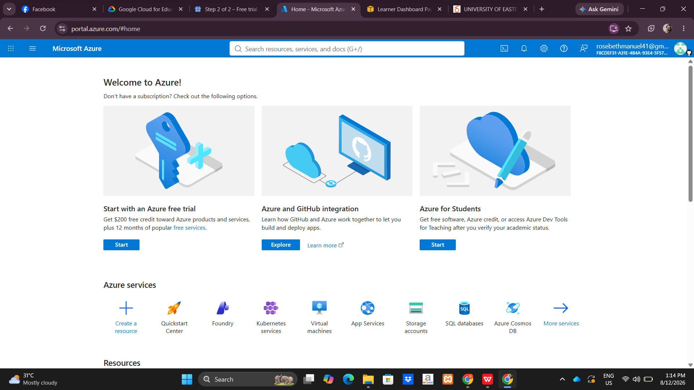

# Microsoft Azure Research

## Brief Overview

Microsoft Azure is a public cloud platform that provides computing, storage, networking, databases, security, and AI services.

## Global Infrastructure

Azure has a global network of **Regions** and **Availability Zones** that support reliable and scalable cloud applications.

## Cloud Management Console

The **Azure Portal** is a web-based console used to create, manage, and monitor Azure resources.

## Four Core Services

1. **Azure Virtual Machines** – Provides virtual servers for applications.
2. **Azure Blob Storage** – Stores files and other unstructured data.
3. **Azure Virtual Network** – Provides private networking.
4. **Microsoft Entra ID** – Manages users and access to resources.

## Three Advantages

* Strong Microsoft integration
* Global infrastructure
* Enterprise-friendly services

## Typical Enterprise Use Cases

* Windows Server hosting
* Hybrid cloud
* Enterprise applications
* Identity management
* Database and web applications

