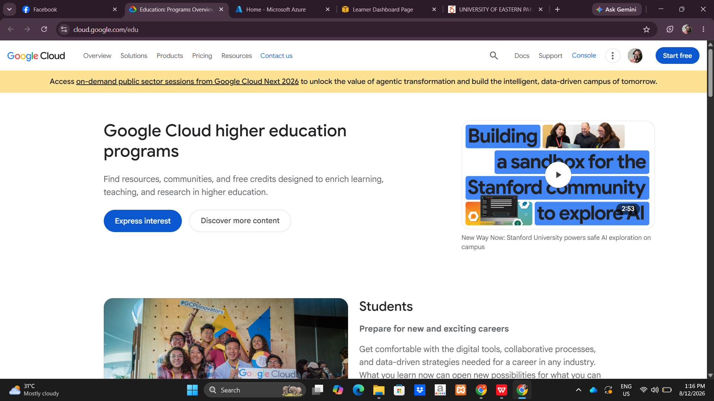

# Google Cloud Platform (GCP) Research

## Brief Overview

Google Cloud Platform (GCP) is a public cloud platform that provides computing, storage, networking, databases, AI, and Machine Learning services.

## Global Infrastructure

Google Cloud uses **Regions and Zones** around the world to provide scalable and reliable cloud infrastructure.

## Cloud Management Console

The **Google Cloud Console** is a web-based interface used to manage Google Cloud projects and resources.

## Four Core Services

1. **Compute Engine** – Provides virtual machines.
2. **Cloud Storage** – Stores files and other data.
3. **Google Kubernetes Engine (GKE)** – Manages containerized applications.
4. **Cloud IAM** – Manages users, roles, and permissions.

## Three Advantages

* Strong AI and Machine Learning capabilities
* Strong Kubernetes support
* Global and scalable infrastructure

## Typical Enterprise Use Cases

* AI and Machine Learning
* Kubernetes applications
* Data analytics
* Website and application hosting
* High-performance computing

## Screenshot

