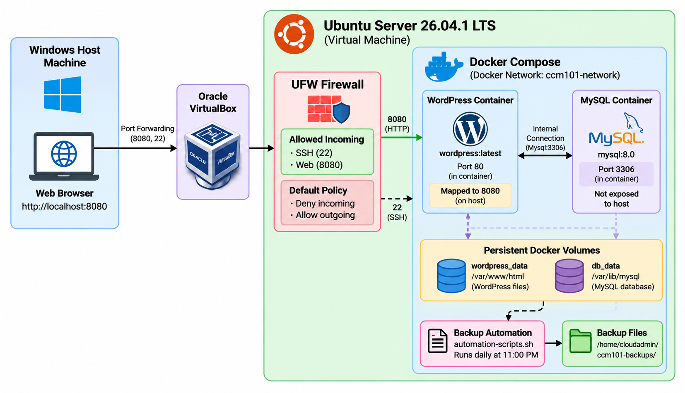

# CCM101 Enterprise Cloud Architect

## Project Overview

This project demonstrates the deployment and management of a multi-tier web application using cloud and virtualization concepts.

The system uses a Windows host machine running Oracle VirtualBox with Ubuntu Server 26.04.1 LTS as the virtual machine. Docker Compose is used to deploy WordPress and MySQL as separate but connected containers.

The project also implements persistent storage, firewall protection using UFW, and automated database backups using Bash and Cron.

---

## Group Members

1. **MANUEL, ROSEBETH B.** – Leader, Developer, Designer
2. **MORALES, EINSTEIN C.** – Developer, Researcher
3. **DIÑO, CHRISTINE SAIYAN C.** – Researcher, Presenter
4. **PALABAY, LYRA ANN A.** – Designer, Presenter

---

## Technologies Used

- Windows Host Machine
- Oracle VirtualBox
- Ubuntu Server 26.04.1 LTS
- Docker
- Docker Compose
- WordPress
- MySQL 8.0
- Bash
- Cron
- UFW Firewall
- GitHub

---

## Architecture

The following diagram shows the complete infrastructure architecture of the project, including the Windows host machine, Oracle VirtualBox, Ubuntu Server, UFW firewall, Docker containers, persistent storage, and automated backup process.

---

## System Architecture

The project follows a multi-tier architecture:

### Physical Host

The physical host machine runs Windows and provides the hardware resources required by the virtual machine.

### Hypervisor

Oracle VirtualBox is used as the virtualization platform for running Ubuntu Server.

### Virtual Machine

Ubuntu Server 26.04.1 LTS serves as the operating system where Docker and the application stack are deployed.

### Firewall

UFW (Uncomplicated Firewall) protects the Ubuntu Server by controlling incoming and outgoing network traffic.

The firewall configuration uses:

- SSH – Port 22
- Web Application – Port 8080
- Default incoming traffic – Denied
- Default outgoing traffic – Allowed

### Container Platform

Docker Compose manages the application containers.

The system contains two main services:

- WordPress
- MySQL

### Web Application

WordPress provides the web application and user interface.

The website can be accessed through:

http://localhost:8080
Database

MySQL 8.0 stores the WordPress application data.

The MySQL database is connected internally to the WordPress container and is not directly exposed to the host.

Docker Services

The Docker Compose configuration contains two connected services.

WordPress

WordPress runs the web application.

Configuration:

Image: wordpress:latest
Container: ccm101-wordpress
Host Port: 8080
Container Port: 80
MySQL

MySQL provides the database service.

Configuration:

Image: mysql:8.0
Container: ccm101-mysql
Internal Port: 3306

The WordPress container communicates with MySQL through the Docker network.

Persistent Storage

Docker named volumes are used to preserve application and database data.

WordPress Volume
wordpress_data

This stores WordPress files and application data.

MySQL Volume
db_data

This stores MySQL database files.

Persistent volumes allow the application data to remain available even when containers are stopped or recreated.

Important: Do not use docker compose down -v unless you intentionally want to delete the persistent volumes and their stored data.

Starting the Application

Navigate to the project directory:

cd ~/ccm101-enterprise-cloud

Start the Docker services:

docker compose up -d

Check the running containers:

docker compose ps

Both WordPress and MySQL should show a running status.

Accessing the Website

After starting the containers, open a web browser on the host machine and visit:

http://localhost:8080

The deployed website is the:

CCM101 Coffee House

The website contains the customized coffee shop homepage and related pages.

Stopping the Application

To stop the Docker services without removing persistent data:

docker compose stop

To start the services again:

docker compose start

To stop and remove the containers while keeping the named volumes:

docker compose down
Firewall Security

UFW is used to secure the Ubuntu Server.

The firewall configuration uses a default-deny policy for incoming connections.

Check Firewall Status
sudo ufw status verbose
Default Firewall Policies
sudo ufw default deny incoming
sudo ufw default allow outgoing
Allow SSH
sudo ufw allow 22/tcp
Allow Web Application
sudo ufw allow 8080/tcp
Enable UFW
sudo ufw enable

The firewall allows only the required ports:

Port	Service	Purpose
22	SSH	Remote administration
8080	WordPress	Web application

MySQL port 3306 is not exposed to the host because it is only required for internal communication between the Docker containers.

Database Backup Automation

The project includes an automated MySQL backup system using Bash.

The backup script is:

automation-script.sh

The script creates compressed MySQL database backups using:

.sql.gz

Backup files are stored in:

/home/cloudadmin/ccm101-backups/

The backup directory also contains the backup log:

backup.log
Manual Backup

The backup script can be executed manually using:

./automation-script.sh

The generated backup files can be checked using:

ls -lh ~/ccm101-backups

Example backup format:

wordpress_backup_YYYY-MM-DD_HH-MM-SS.sql.gz
Cron Automation

Cron is used to automatically run the database backup.

The scheduled backup time is:

11:00 PM every day

Cron schedule:

0 23 * * *

The scheduled task runs the backup script and records output in:

/home/cloudadmin/ccm101-backups/backup.log

To view the current Cron configuration:

crontab -l

To check the Cron service:

sudo systemctl status cron --no-pager
Monitoring and Verification

The following commands can be used to verify the system.

Check Docker Containers
docker compose ps
Check Docker Logs
docker compose logs
Check WordPress Logs
docker compose logs wordpress
Check MySQL Logs
docker compose logs mysql
Check Firewall
sudo ufw status verbose
Check Backup Files
ls -lh ~/ccm101-backups
Test Website Connectivity
curl -I http://localhost:8080

A successful connection should return:

HTTP/1.1 200 OK
Troubleshooting
Docker Containers Are Not Running

Check the container status:

docker compose ps

View the logs:

docker compose logs

Restart the services:

docker compose restart
Website Cannot Be Accessed

Check whether WordPress is running:

docker compose ps

Check whether port 8080 is allowed:

sudo ufw status

Test the application locally:

curl -I http://localhost:8080
Database Connection Problem

Check the MySQL container:

docker compose logs mysql

Check the WordPress container:

docker compose logs wordpress

Make sure both containers are running.

Backup Is Not Created

Check whether the backup script is executable:

ls -l automation-script.sh

If necessary, make it executable:

chmod +x automation-script.sh

Run the script manually:

./automation-script.sh

Check the backup directory:

ls -lh ~/ccm101-backups
Cron Is Not Running

Check Cron:

sudo systemctl status cron --no-pager

Check the scheduled task:

crontab -l

Check the backup log:

cat ~/ccm101-backups/backup.log
Maintenance

Regular maintenance should include:

Checking Docker container status
Checking application logs
Checking UFW firewall status
Checking available disk space
Verifying database backups
Testing website connectivity
Reviewing Cron execution
Keeping Docker images updated when appropriate

Useful commands:

docker compose ps
df -h
sudo ufw status verbose
ls -lh ~/ccm101-backups
Recovery

If the application needs to be restored, the database backup can be used to recover the MySQL data.

Backup files are stored in:

/home/cloudadmin/ccm101-backups/

Example:

wordpress_backup_YYYY-MM-DD_HH-MM-SS.sql.gz

Before performing a recovery, make sure the Docker services are properly stopped or prepared for database restoration.

Persistent Docker volumes should also be preserved unless a complete reset is intentionally required.

Project Files

The GitHub repository contains the following project files:

Laboratory-10-Enterprise-Cloud-Architect/
│
├── README.md
├── architecture-diagram.png
├── docker-compose.yml
├── automation-script.sh
├── operational-manual.md
└── final-reflection.md
README.md

Contains the project overview, architecture, deployment procedures, security configuration, backup automation, monitoring, and troubleshooting information.

architecture-diagram.png

Contains the visual architecture diagram of the complete enterprise cloud infrastructure.

docker-compose.yml

Contains the Docker Compose configuration for the WordPress and MySQL services.

automation-script.sh

Contains the Bash automation script for database backup.

operational-manual.md

Contains the detailed operational procedures and verification screenshots.

final-reflection.md

Contains the group's reflection about the project, implementation process, challenges, and lessons learned.

Documentation

The project includes an operational manual containing:

Project overview
System architecture
Infrastructure components
Docker deployment
Persistent storage
Firewall configuration
Backup automation
Cron scheduling
Monitoring commands
Troubleshooting procedures
Recovery procedures
Verification screenshots
Operational Checklist

Before considering the deployment complete, verify the following:

 Ubuntu Server installed and running in VirtualBox
 Docker installed
 Docker Compose configured
 WordPress container running
 MySQL container running
 WordPress connected to MySQL
 Persistent Docker volumes configured
 WordPress website accessible
 UFW firewall enabled
 SSH port 22 allowed
 Web application port 8080 allowed
 MySQL not directly exposed
 Bash backup script created
 Database backup successfully generated
 Cron backup schedule configured
 Backup log generated
 HTTP connectivity verified
 Project documentation completed
 Architecture diagram included
 Project files uploaded to GitHub
Conclusion

The CCM101 Enterprise Cloud Architect project demonstrates the deployment of a multi-tier web application using virtualization, containerization, persistent storage, firewall security, and automated database backup.

The system combines Windows, Oracle VirtualBox, Ubuntu Server, Docker Compose, WordPress, MySQL, UFW, Bash, Cron, and GitHub into one complete deployment workflow.

The completed system provides a functional WordPress application with persistent storage, controlled network access, automated database backups, and documented operational procedures.

The project demonstrates practical cloud computing and system administration concepts that can be applied to real-world application deployment and infrastructure management.
